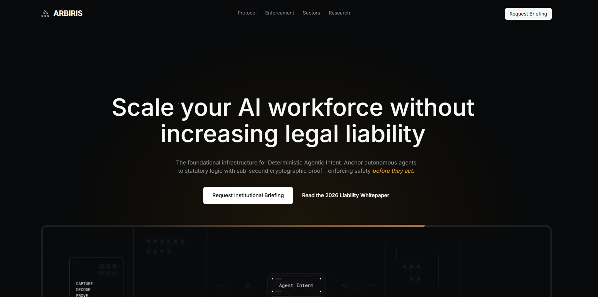

<p align="center">
  <picture>
    <source media="(prefers-color-scheme: dark)" srcset="./public/icons/logo.svg" />
    
  </picture>
</p>

<div align="center">
  <h2>
    Arbiris — marketing site and content layer for deterministic agentic intent
    <br />
    <sub>Public experience, blog, and Sanity-powered authoring in one Next.js application.</sub>
  </h2>
</div>

<div align="center">
  <figure>
    <a href="#" target="_blank" rel="noopener noreferrer">
      
    </a>
    <figcaption>
      <p align="center">
        Landing experience — hero, navigation, and intent narrative (Open Graph image asset).
      </p>
    </figcaption>
  </figure>
</div>

---

## Overview

**Arbiris** is the public web presence for Arbiris: a multi-section marketing homepage, a searchable blog with categories, and an embedded **Sanity Studio** for editors. The stack is optimized for fast iteration on content and UI while staying easy to deploy on **Vercel**.

Site metadata and positioning emphasize **provable intent**, **statutory alignment**, and **audit-ready visibility** for regulated, agentic workloads—the narrative the homepage sections carry today.

## Features

- **Marketing homepage** — Hero, partner strip, intent/statutory story sections, trust and compliance narratives, sectors, risk framing, and primary calls to action.
- **Blog** — Listing with **search**, **category filters**, individual post pages, and portable text–friendly article rendering.
- **Sanity CMS** — Structured blog content (posts, authors, categories, rich blocks) with **Sanity Studio** under the admin route group.
- **Modern UI** — **Tailwind CSS**, **Framer Motion**, and shared layout primitives for consistent section rhythm.
- **Type-safe app shell** — **Next.js App Router**, **React 19**, and **TypeScript** end to end.

## Repository layout

```
arbiris/
├── app/
│   ├── (user)/                 # Public marketing site and blog routes
│   │   ├── page.tsx            # Home (composed marketing sections)
│   │   └── blog/               # Blog index and [id] post pages
│   └── (admin)/                # Sanity Studio (embedded tool)
├── components/
│   ├── home/                   # Homepage sections
│   ├── blog/                   # Blog list, article, filters, search
│   ├── layout/                 # Header, footer
│   ├── shared/                 # Cross-page UI helpers
│   └── contact-popups/         # Lead / newsletter style forms
├── public/
│   ├── images/                 # Social / OG imagery (`og-image.png`)
│   └── icons/                  # Brand and illustrative SVG assets
├── sanity/
│   ├── schemaTypes/            # Content models
│   ├── lib/                    # Client, live, image helpers
│   └── structure.ts            # Studio structure
├── hooks/
├── utils/
├── package.json
└── README.md
```

## Prerequisites

- **Node.js** — LTS recommended (matches the engines your team standardizes on).
- **npm** — lockfile is `package-lock.json` (use `pnpm` / `yarn` only if you maintain the lockfile accordingly).

## Environment

Create a `.env.local` (or follow your team’s env convention) with at least:

- `NEXT_PUBLIC_SANITY_PROJECT_ID`
- `NEXT_PUBLIC_SANITY_DATASET`
- Optional: `NEXT_PUBLIC_SANITY_API_VERSION` (defaults are set in `sanity/env.ts`)
- Optional: `NEXT_PUBLIC_SITE_URL` — canonical site origin for Open Graph / Twitter card URLs (defaults to `https://arbiris.vercel.app` in `app/layout.tsx` when unset)

Add any **preview / read token** variables your deployment uses for draft or private content. Without a real project ID and dataset, Studio and live blog queries will not connect to your Sanity project.

## Development

Install dependencies and start the dev server:

```bash
npm install
npm run dev
```

Open [http://localhost:3000](http://localhost:3000) for the public site and [http://localhost:3000/studio](http://localhost:3000/studio) for Sanity Studio when routing is enabled in your environment.

Other scripts:

```bash
npm run build    # Production build
npm run start    # Run production server (after build)
npm run lint     # ESLint
```

## Production

The reference deployment is on **Vercel** ([arbiris.vercel.app](https://arbiris.vercel.app)). Configure the same environment variables in the Vercel project settings as in local development.

## Key dependencies

| Package        | Role |
| -------------- | ---- |
| [Next.js](https://nextjs.org/) | App Router, SSR/RSC, routing, deployment story |
| [React](https://react.dev/) | UI |
| [Sanity](https://www.sanity.io/) | Headless CMS, Studio, structured content |
| [next-sanity](https://github.com/sanity-io/next-sanity) | Next.js integration for Sanity |
| [Tailwind CSS](https://tailwindcss.com/) | Styling |
| [Framer Motion](https://www.framer.com/motion/) | Motion and transitions |

## Contributing

Contributions are welcome: open issues for bugs or product gaps, and pull requests for fixes and improvements. Keep changes focused and consistent with existing patterns in `components/` and `sanity/`.

## Learn more

- [Next.js documentation](https://nextjs.org/docs)
- [Sanity documentation](https://www.sanity.io/docs)
